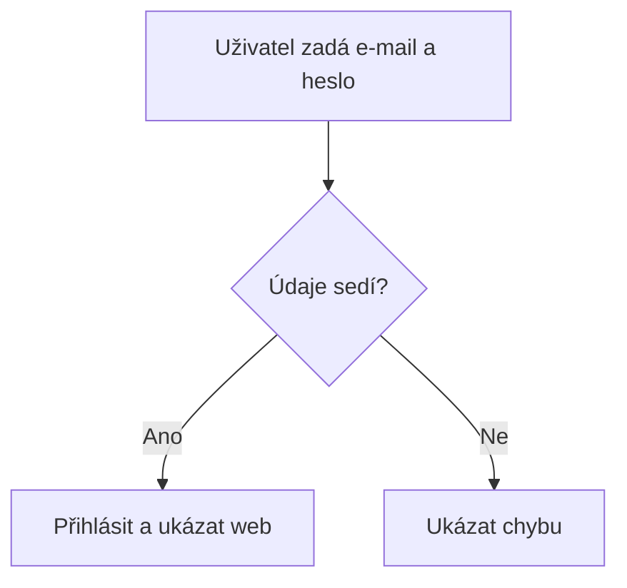
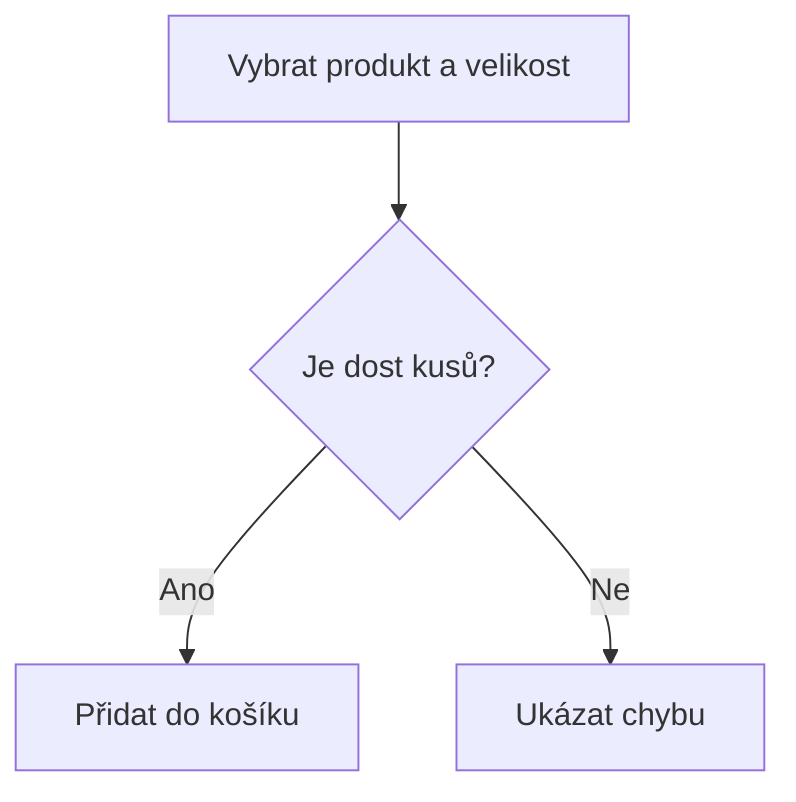
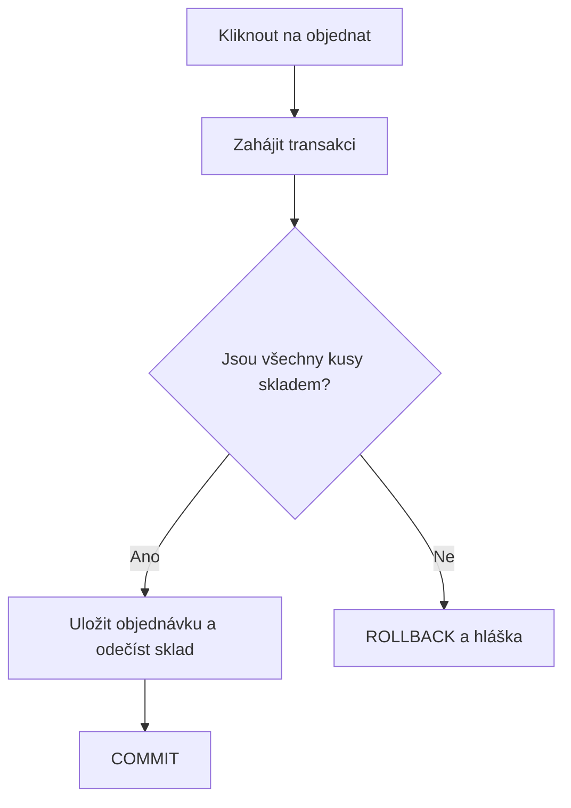

# Tři jednoduché vývojové diagramy

## 1. Přihlášení

```mermaid
flowchart TD
 A[Uživatel zadá e-mail a heslo] --> B{Údaje sedí?}
 B -- Ano --> C[Přihlásit a ukázat web]
 B -- Ne --> D[Ukázat chybu]
```

## 2. Přidání do košíku

```mermaid
flowchart TD
 A[Vybrat produkt a velikost] --> B{Je dost kusů?}
 B -- Ano --> C[Přidat do košíku]
 B -- Ne --> D[Ukázat chybu]
```

## 3. Objednávka

```mermaid
flowchart TD
 A[Kliknout na objednat] --> B[Zahájit transakci]
 B --> C{Jsou všechny kusy skladem?}
 C -- Ano --> D[Uložit objednávku a odečíst sklad]
 D --> E[COMMIT]
 C -- Ne --> F[ROLLBACK a hláška]
```
